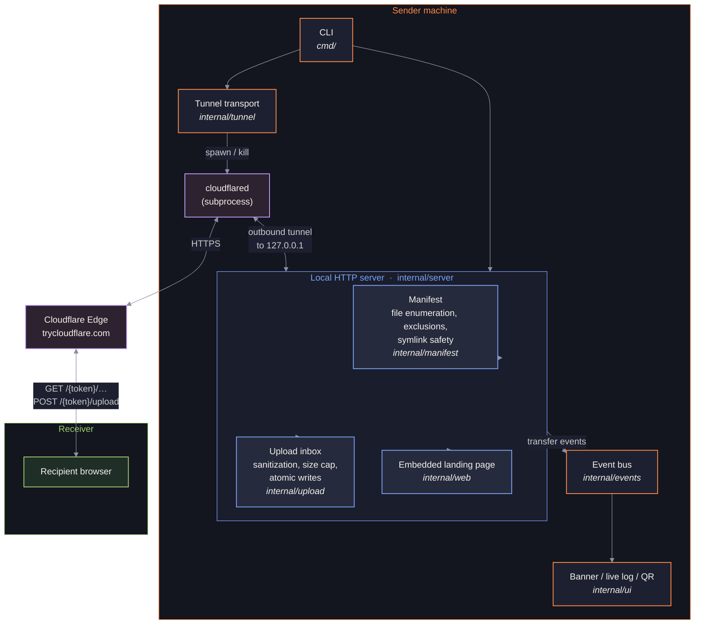

# orbital

[](https://github.com/ul0gic/orbital/actions/workflows/ci.yml)
[](https://github.com/ul0gic/orbital/actions/workflows/release.yml)
[](https://goreportcard.com/report/github.com/ul0gic/orbital)
[](https://pkg.go.dev/github.com/ul0gic/orbital)
[](https://github.com/ul0gic/orbital/releases)
[](LICENSE)
[](https://github.com/ul0gic/orbital/releases)

Ephemeral two-person file exchange over a Cloudflare quick tunnel. Run it in a folder, share the link with one person, press Ctrl-C when the exchange is done. The link dies with the process.

---

## How it works



Any request that does not carry the exact session token gets a bare 404 with no body confirming existence.

---

## Install

### 1. Install cloudflared (required)

orbital spawns `cloudflared` to create the tunnel — it is not bundled and must be on your PATH.

```bash
# macOS
brew install cloudflared

# Linux (Debian/Ubuntu) — add Cloudflare's repo first, see https://pkg.cloudflare.com/
sudo apt install cloudflared
```

### 2. Install orbital

Requires Go 1.26+.

```bash
go install github.com/ul0gic/orbital@latest
```

---

## Quick start

```bash
cd ~/folder-with-files
orbital
```

orbital prints a share URL to stdout and a banner + QR code to stderr, then streams a live log. Send the URL to the recipient over any private channel (Signal, iMessage, etc.). Watch the log. Press Ctrl-C when the exchange is done.

Serve a single file instead of a folder:

```bash
orbital report.pdf
```

---

## What the recipient sees

The URL opens a self-contained page in any browser — no app, no account, no instructions needed. The working design is a **black hole**: the sender's files orbit the event horizon, and clicking one triggers a normal browser download (native progress bar, resumable, any file size). To send a file back, the recipient drags it onto the black hole or uses the file picker.

The page has a **reduced-motion / no-WebGL fallback**: if `prefers-reduced-motion` is set or WebGL is unavailable, the page renders as a clean static file list with identical download and upload functionality. The visual is a layer, never a dependency. No CDN calls, no third-party assets, no analytics — the entire page is embedded in the binary.

---

## Usage

```
orbital [path] [flags]
```

`path` is optional. Omit it to serve the current directory; pass a directory path to serve that folder; pass a single file to serve only that file.

### Flags

| Flag | Default | Description |
|------|---------|-------------|
| `--all` | off | Serve hidden and sensitive files. By default `.ssh`, `.env*`, `.git`, `*.pem`, `*.key`, and similar patterns are excluded. |
| `--no-upload` | off | Disable upload-back. Serve files for download only; the upload affordance is hidden on the page. |
| `--max-upload` | `2GiB` | Maximum size for a single uploaded file. Accepts `500MB`, `2GB`, `512MiB`, bare byte counts, etc. Enforced server-side with `http.MaxBytesReader`. |
| `--port` | `0` | Local port to bind. `0` picks a free port automatically. |
| `--version` | — | Print version and exit. |

### Pipe-safe behavior

The share URL is the only thing written to **stdout**, so `orbital | pbcopy` works. All human-readable output — the banner, QR code, live log, and errors — goes to **stderr**. Colors and the QR code are suppressed automatically when stderr is not a TTY.

---

## Live log

Once the tunnel is live, orbital appends one line per event. Each line is timestamped and prefixed with a glyph and label:

```
18:04:22 ● ready      https://crossing-shareware.trycloudflare.com/3f9a8c…/
18:05:01 ◉ visitor    page opened (Chrome, 203.0.113.7)
18:05:09 ↓ download   report.pdf (48.2 MB) started
18:05:31 ✓ download   report.pdf (48.2 MB) complete in 22s
18:06:02 ↑ upload     photos.zip (112 MB) started
18:06:40 ✓ upload     photos.zip → orbital-inbox/ complete
18:07:13 ✗ upload     huge.iso rejected (Request Entity Too Large)
```

Event types: `ready`, `visitor`, `download` (start + complete), `upload` (start + complete + rejected), `error`. The log is append-only — no TUI loop, no screen clearing.

---

## Session lifecycle

A session exists for exactly as long as the process runs. There is no timer, no download count limit, no automatic expiry — by design. The person running orbital is the access control:

- **Start:** run the command. The link is live once the tunnel registers (~4 seconds).
- **Stop:** press Ctrl-C. The cloudflared process group is killed immediately, tearing down the tunnel. The local HTTP server drains any in-flight transfers (up to 10 seconds), then exits. The link stops working the moment Ctrl-C is pressed — the tunnel is gone before the server shuts down.

Nothing persists after the process exits. Any files uploaded during the session remain in `orbital-inbox/` on your machine; nothing else is left behind.

---

## Safety defaults

- **Hidden and sensitive files are excluded by default.** The manifest is built once at startup; only enumerated files are reachable. Default exclusions include all dotfiles and a named denylist: `.ssh`, `.git`, `credentials`, `.env*`, `*.pem`, `*.key`, `id_rsa*`, `*history`. Use `--all` to override.
- **Symlinks that escape the served folder are excluded.** Symlinks are resolved at manifest-build time; any link whose real path falls outside the root is silently omitted.
- **Serving is read-only.** The recipient can only download files explicitly in the manifest, or upload to the inbox. They cannot browse, delete, or modify anything.
- **Uploads land in `orbital-inbox/`** inside the served folder and nowhere else. Filenames are reduced to a safe basename (path separators and traversal stripped). Duplicate names get a numeric suffix (`report.pdf`, `report (1).pdf`, …) — nothing is ever overwritten.
- **Upload cap.** Each upload is bounded by `--max-upload` (default 2 GiB), enforced server-side before data is written to disk.

---

## Trust model

The link is the secret: the tunnel hostname is a random subdomain assigned by Cloudflare, and the URL contains an additional 128-bit random session token. Any request that omits the token gets a bare 404.

Traffic is encrypted on both hops: recipient to Cloudflare edge (HTTPS), and Cloudflare edge to the sender's machine (the cloudflared encrypted tunnel). No one on the network path outside Cloudflare can read the traffic.

Cloudflare is the trusted relay. TLS terminates at Cloudflare's edge, so Cloudflare could technically observe transfers in flight. Sessions last minutes and nothing is retained afterward, but if that is unacceptable for your use case, use a peer-to-peer tool instead. End-to-end encryption (fragment-key model, WebCrypto in the browser) is on the roadmap and will not require rearchitecting.

Sender and recipient never see each other's IP addresses; both only communicate with Cloudflare.

---

## Limitations

Cloudflare quick tunnels (`*.trycloudflare.com`) are a free, unauthenticated service provided on a best-effort basis with no SLA. Rate limits are undocumented and subject to change. For the intended use case — a minutes-long, two-person exchange — this is fine in practice. If the tunnel fails to register within 30 seconds, orbital exits with a clear error. If Cloudflare's quick-tunnel capacity is degraded in your region, the tool will not work until it recovers. For transfers requiring a reliability guarantee, use a service with an SLA or run a named Cloudflare tunnel with your own account.

---

## License

MIT — see [LICENSE](LICENSE).
